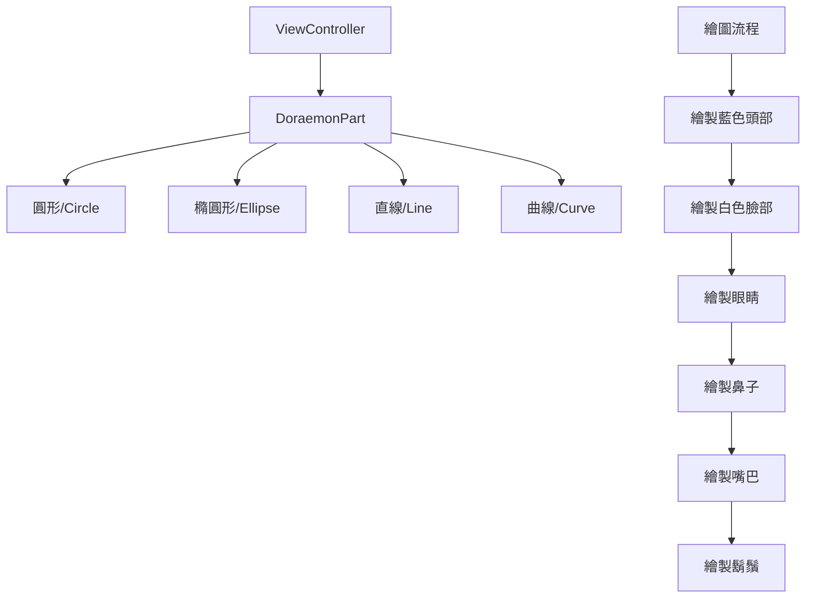

# 作業5：哆啦A夢繪圖程式

## 專案說明
這是一個使用 Swift 和 UIKit 開發的 iOS 應用程式，用程式碼繪製哆啦A夢的臉部。

## 功能特點
- 使用 UIBezierPath 繪製基本圖形
- 實現圓形、橢圓形、線條等基本圖形繪製
- 支援對稱繪圖功能
- 自定義顏色和大小

## 技術架構
- 開發語言：Swift
- 框架：UIKit
- 最低支援版本：iOS 18.2

## 專案結構

## 繪圖流程說明
1. 頭部：使用藍色圓形
2. 臉部：使用白色橢圓形
3. 眼睛：使用白色橢圓形配合黑色瞳孔
4. 鼻子：使用紅色圓形
5. 嘴巴：使用黑色曲線
6. 鬍鬚：使用黑色直線（每邊三條）

## 類別說明
- ViewController: 主要控制器，負責組織和布局所有元件
- DoraemonPart: 自定義 UIView 子類，負責繪製各種圖形
  - 支援的圖形類型：
    - circle: 圓形
    - ellipse_w: 寬橢圓
    - ellipse_l: 窄橢圓
    - line: 直線
    - curve: 曲線